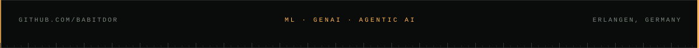

## 01 · WHOAMI

I build **agent harnesses**: the orchestration, retrieval, tooling and evaluation
layers that decide whether an LLM demo becomes a system that survives production.

By day I build AI agents at **Siemens Digital Industries Software**, where the
interesting part is everything the demo never shows you: latency, token budgets,
failing retries, and retrieval that quietly returns the wrong thing. Alongside
that I am finishing an **M.Sc. in Artificial Intelligence** at FAU Erlangen-Nürnberg,
with a research affiliation at the **Institute FAPS**, using fine-tuned LLMs and
multi-agent workflows to generate and validate **SysML v2** models.

- **Working with:** LangGraph · Deep Agents · RAG · PyTorch · Ollama · Docker
- **Certified:** LangChain Academy *Project: Deep Agents* · Hugging Face *AI Agents Fundamentals*
- **Portfolio:** [babitdorkhonglah.netlify.app](https://babitdorkhonglah.netlify.app), terminal-themed, command palette included

## 02 · SELECTED WORK

| Project | What it does | Built with |
| :-- | :-- | :-- |
| **[NovaCode](https://github.com/Babitdor/NovaCode)** | Terminal AI coding assistant: deep-agent loop, Textual TUI, subagents, skills, two-tier memory, headless mode for CI | `Python` `LangGraph` `Textual` |
| **[SysML v2 Agentic Workflow](https://github.com/Babitdor/SysMLv2-CodeGeneration_AgenticWorkflow)** | Multi-agent pipeline that drafts, validates and self-corrects SysML v2 models against a vector knowledge base | `Python` `LangGraph` `Qdrant` |
| **[Ada, AI Security Operator](https://github.com/Babitdor/Ada-CybSecure)** | Autonomous security agent: terminal workstation, sandboxed tool runs, live attack-graph memory, approval gates | `Python` `Rust` `Docker` |
| **[InferenceEngine](https://github.com/Babitdor/InferenceEngine)** | Local llama.cpp server behind an OpenAI-compatible API, with Prometheus metrics | `Python` `llama.cpp` |
| **[SAM 2.1 Sidewalk Segmentation](https://github.com/Babitdor/FineTune-Script-SAM2.1)** | Fine-tuning SAM 2.1 on multi-class masks to improve the official SENSATION dataset | `PyTorch` |
| **[SysML v2 models on Ollama](https://ollama.com/Babitdor)** | Three fine-tuned Qwen models (2.5-Coder, 3-8B, 3-4B) that generate and reason about SysML v2 | `LoRA` `Ollama` |

Master's thesis: a **9-agent MBSE harness** that turns requirements into validated
SysML v2 artifacts end to end, resolving 50+ dependency DAG nodes across all four
RFLP phases on a Docker sandbox backend.

## 03 · TOOLKIT

**AI & AGENTS**

      

**LANGUAGES**

     

**MODELS & LOCAL AI**

   

**DATA & VECTOR**

  

**FRONTEND & APPS**

    

**INFRA & OPS**

       

The full 39-entry stack map lives on the [portfolio](https://babitdorkhonglah.netlify.app).

## 04 · TELEMETRY

<table>
  <tr>
    <td></td>
    <td></td>
  </tr>
</table>

  

## 05 · ELSEWHERE

     

